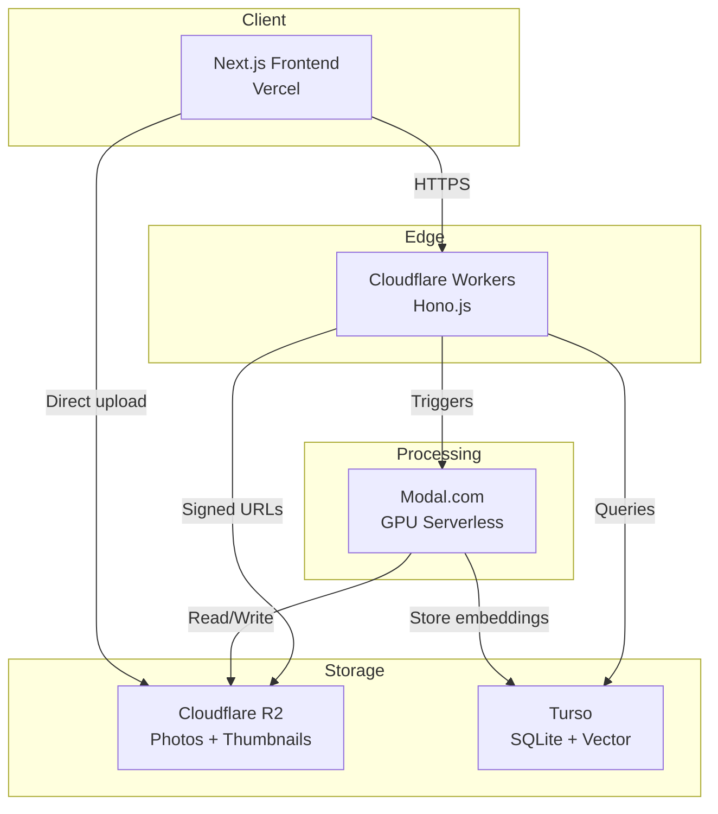
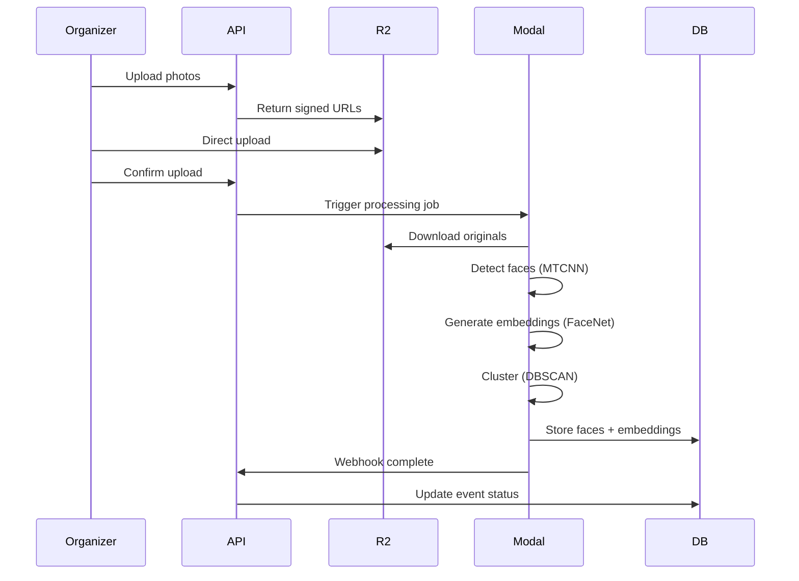
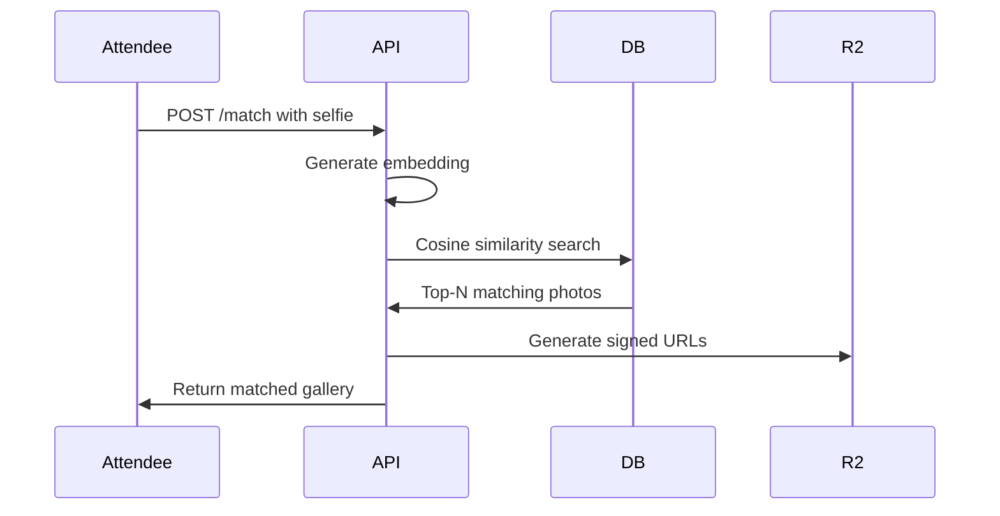

# GrabPic

Facial recognition-powered event photo distribution. Organizers upload photos once; attendees take a selfie and get a personalized gallery in under 5 seconds.

## Architecture



## Project Structure

```
GrabPic/
├── apps/
│   ├── web/          # Next.js 14 (App Router) — Organizer dashboard + attendee portal
│   └── api/          # Cloudflare Workers + Hono.js — Edge API layer
├── packages/
│   ├── db/           # Turso (libSQL) client, schema, migrations
│   ├── types/        # Shared TypeScript types across apps
│   └── config/       # Shared tsconfig, eslint configs
├── ml/
│   ├── processor.py  # Modal.com GPU serverless functions
│   └── requirements.txt
├── tests/            # Integration tests against real infrastructure
├── docs/             # Engineering docs (API contracts, schema, deploy checklist)
├── .env.example      # All required environment variables
└── AGENTS.md         # AI agent guidelines
```

## Tech Stack

| Layer | Choice |
|-------|--------|
| Frontend | Next.js 14 (App Router) + TypeScript + Tailwind |
| Backend API | Cloudflare Workers + Hono.js |
| Database | Turso (libSQL with vector search) |
| Storage | Cloudflare R2 |
| ML Processing | Modal.com (GPU serverless) |
| Face Recognition | FaceNet / ArcFace (512-dim embeddings) |
| Clustering | DBSCAN |
| Monorepo | pnpm workspaces + Turborepo |

## Workflows

**Upload and Process**



**Selfie Match**



## Getting Started

```bash
# 1. Install dependencies
pnpm install
pip install -r ml/requirements.txt

# 2. Copy env template and fill in your secrets
cp .env.example .env
# Edit .env with your Turso, R2, Cloudflare, and Modal credentials

# 3. Run database migrations
pnpm --filter @grabpic/db migrate

# 4. Start API (local dev with Wrangler)
cd apps/api && pnpm dev

# 5. Start frontend (another terminal)
cd apps/web && pnpm dev
```

## Testing

Tests require real infrastructure (Turso DB, Cloudflare API, etc.). Configure `.env` first, then:

```bash
pnpm vitest run
```

Tests gracefully skip when env vars are missing, so they always pass on CI without secrets. Contract tests (type validation) run regardless.

## Lint

```bash
pnpm lint
```

## Docs

Remaining engineering docs in `docs/modularized_prd/`:

| Doc | What it covers |
|-----|---------------|
| [`api_endpoints_contracts.md`](docs/modularized_prd/api_endpoints_contracts.md) | All API route contracts with request/response shapes |
| [`database_schema_deep_dive.md`](docs/modularized_prd/database_schema_deep_dive.md) | Turso schema (events, photos, faces, embeddings) |
| [`deployment_checklist.md`](docs/modularized_prd/deployment_checklist.md) | Production deployment steps |
| [`development_environment_setup.md`](docs/modularized_prd/development_environment_setup.md) | Dev environment setup |
| [`processing_pipeline_details.md`](docs/modularized_prd/processing_pipeline_details.md) | Modal ML processing pipeline |
| [`privacy_compliance.md`](docs/modularized_prd/privacy_compliance.md) | GDPR/BIPA privacy requirements |
| [`technical_architecture.md`](docs/modularized_prd/technical_architecture.md) | System architecture and data flow |
| [`open_questions.md`](docs/modularized_prd/open_questions.md) | Resolved design decisions |
| [`todo.md`](docs/todo.md) | Full project todo list with completion status |

## License

[MIT](LICENSE)
