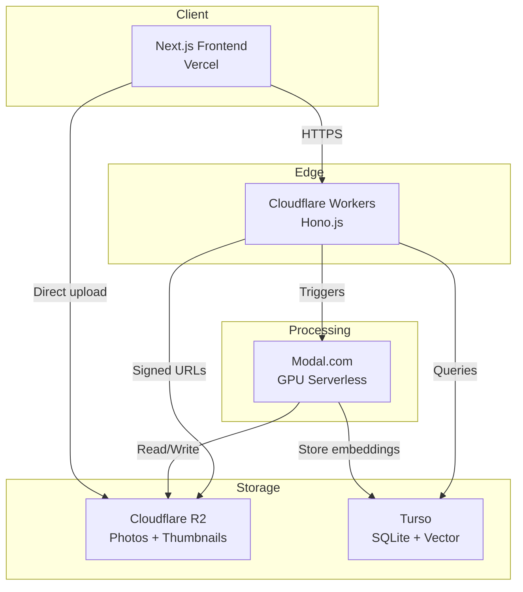
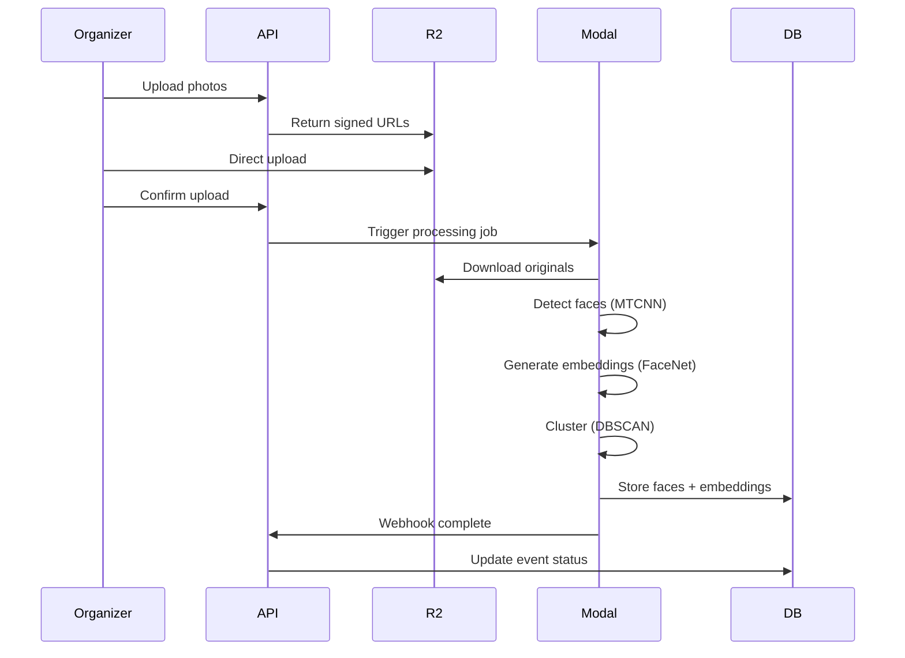
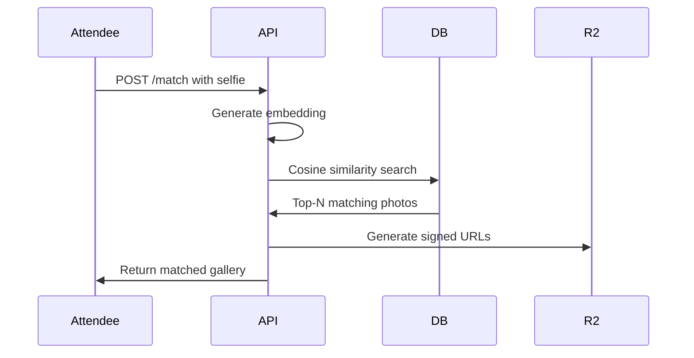

# GrabPic

Facial recognition-powered event photo distribution. Organizers upload photos once; attendees take a selfie and get a personalized gallery in under 5 seconds.

## Architecture



## Project Structure

```
GrabPic/
├── backend/          # Python API + ML processing
│   ├── main.py
│   ├── ML/           # Modal.com serverless functions
│   └── pyproject.toml
├── frontend/         # Next.js app
├── docs/             # PRD and documentation
└── AGENTS.md         # AI agent guidelines
```

## Tech Stack

| Layer | Choice |
|-------|--------|
| Frontend | Next.js 14 (App Router) + TypeScript |
| Backend API | Cloudflare Workers + Hono.js |
| Database | Turso (libSQL with vector search) |
| Storage | Cloudflare R2 |
| ML Processing | Modal.com (GPU serverless) |
| Face Recognition | FaceNet / ArcFace (512-dim embeddings) |
| Clustering | DBSCAN |

## Workflows

**Upload and Process**



**Selfie Match**



## Getting Started

```bash
# Install dependencies
pnpm install
pip install modal

# Set up databases
turso db create grabpic-dev
turso db show grabpic-dev

# Run API
cd backend && python main.py

# Run frontend
cd frontend && pnpm dev
```
