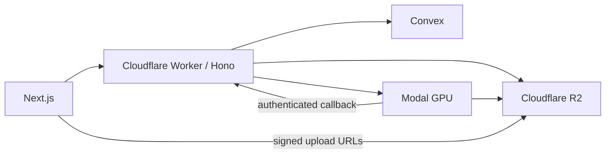

# GrabPic

Facial-recognition event photo distribution. Organizers upload photos once;
attendees take a selfie and receive a personalized gallery.

## Current architecture


```mermaid
flowchart LR
  WEB[Next.js] --> API[Cloudflare Worker / Hono]
  API --> CV[Convex]
  API --> R2[Cloudflare R2]
  API --> MODAL[Modal GPU]
  MODAL --> R2
  MODAL -->|authenticated callback| API
  WEB -->|signed upload URLs| R2
```

The Worker is the only public API boundary. Convex is the authoritative
application database. Modal never receives Convex credentials and never writes
Convex directly; it returns processing results to the authenticated Worker
callback. The frontend does not connect to Convex directly.

## Project structure

```
apps/web       Next.js organizer dashboard and attendee portal
apps/api       Cloudflare Worker, Hono routes, and Convex functions
packages/types Shared API contracts
packages/config Shared TypeScript configuration
ml             Modal GPU processor
tests          Contract, Convex, and local-infrastructure tests
docs           Engineering and deployment notes
```

## Runtime flow

1. The Worker creates an event and returns signed R2 upload URLs.
2. The organizer uploads originals directly to R2 and confirms them through
   the Worker.
3. Convex atomically records the photos and processing job. The Worker invokes
   Modal and returns `202` only after Modal accepts a real job ID.
4. Modal reads originals, runs the pinned 512-dimensional model, writes 200px
   and 800px thumbnails to R2, and posts authenticated result batches back to
   the Worker. The Worker persists them in Convex.
5. Attendee matching invokes Modal for the selfie embedding, then uses the
   event-filtered Convex vector index. The Worker signs R2 gallery URLs.
6. The scheduled Worker cleanup marks events deleting, cancels Modal work,
   deletes R2 assets, and purges Convex records in retryable batches.

Organizer management uses the high-entropy bearer token issued at event
creation; only its SHA-256 hash is stored. Attendee lookup remains sanitized.
Biometric data expires after 30 days. The North Star remains selfie to gallery
under five seconds.

## Getting started

```bash
pnpm install
cp .env.example .env
pnpm --filter @grabpic/api convex:dev
pnpm --filter @grabpic/api dev
pnpm --filter @grabpic/web dev
```

Set the local Convex URL and Worker secrets in local env files. Never commit
filled env files. See [docs/deployment.md](docs/deployment.md) for deployed
configuration and the local fixture environment.

## Verification

```bash
pnpm lint
pnpm build
pnpm vitest run
python -m unittest ml/test_processor.py
python -m compileall ml
```

Infrastructure suites are skipped unless `RUN_REAL_INFRA_TESTS=1` is set. The
local Convex suites and deterministic fixtures run without cloud credentials.

## Documentation

- [Deployment](docs/deployment.md)
- [Convex migration plan](docs/convex-refactor.md)
- [Convex evaluation](docs/convex-evaluation.md)
- [API examples](docs/api-examples.md)
- [Privacy requirements](docs/modularized_prd/privacy_compliance.md)

## License

[MIT](LICENSE)
