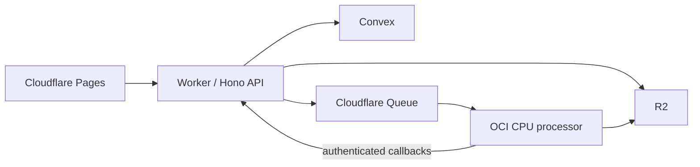

# GrabPic

Event photo distribution with consented selfie matching. Organizers upload photos once; attendees receive an event-scoped personalized gallery.

## Deployment architecture


```mermaid
flowchart LR
  Pages[Cloudflare Pages] --> Worker[Worker / Hono API]
  Worker --> Convex
  Worker --> R2
  Worker --> Queue[Cloudflare Queue]
  Queue --> OCI[OCI CPU processor]
  OCI --> R2
  OCI -->|authenticated callbacks| Worker
```

Cloudflare Pages serves a static Next.js export and an invite redirect Function. The Worker remains the only public application API. The processor runs FastAPI behind Nginx on OCI and never receives Convex credentials. The selfie and batch paths use the same pinned FaceNet weights. An E2.1.Micro VM is unproven for the under-five-second matching target, so a measured staging gate is mandatory.

## Local development and verification

```bash
pnpm install --frozen-lockfile
pnpm --filter @grabpic/api convex:dev
pnpm --filter @grabpic/api dev
pnpm --filter @grabpic/web dev
pnpm lint
pnpm build
pnpm vitest run
python -m unittest ml/test_processor.py ml/test_server.py
python -m compileall -q ml
```

Local unit and contract tests do not run model inference. Deployed infrastructure tests opt in with `RUN_REAL_INFRA_TESTS=1`. See [deployment](docs/deployment.md) for environment ownership, deploy order, and staging sign-off.

## Structure

- `apps/web`: Next.js organizer and attendee pages
- `apps/api`: Hono Worker, Queue consumer, Convex functions
- `ml`: pinned CPU processor and persistent job API
- `functions/e/[code].ts`: Pages invite redirect
- `deploy/oci`: Nginx and systemd examples
- `packages/types`: shared contracts
- `tests`: deterministic contracts and opt-in infrastructure tests

[MIT](LICENSE)
