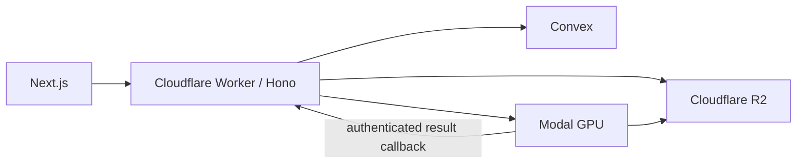

# GrabPic Technical Architecture

This document describes the current production path. The approved migration
keeps the public edge boundary and replaces the application database with
Convex.



## Upload and processing

```text
Organizer -> Worker: create event and request signed uploads
Organizer -> R2: upload originals
Organizer -> Worker: confirm upload
Worker -> Convex: atomic photo/job mutation
Worker -> Modal: request processing; require accepted job ID
Modal -> R2: read originals and write 200px/800px thumbnails
Modal -> Worker: authenticated batches of at most 25 faces
Worker -> Convex: validate and persist metadata/512-d vectors
Convex -> Worker: ready state after final callback
```

Modal never writes Convex directly. Callback bodies, embeddings, and service
secrets are excluded from logs and analytics.

## Matching

```text
Attendee -> Worker: selfie and event credential
Worker -> Modal: pinned-model selfie embedding
Worker -> Convex: event-filtered vector search, limit 256
Worker -> R2: sign original and 800px thumbnail keys
Worker -> Attendee: matched gallery
```

Every face stores its event reference and the vector index requires equality
filtering on that event. The Worker applies the server-owned threshold and
deduplicates results by photo. The 256-candidate ceiling remains an explicit
acceptance risk.

## Deletion and expiry

The scheduled Worker marks an event `deleting`, cancels Modal work, deletes all
R2 originals and thumbnails, and asks Convex to purge faces, match sessions,
processing jobs, photos, and the event in batches of 500. The event is deleted
last. Failures record sanitized retry state; delayed callbacks are rejected.
